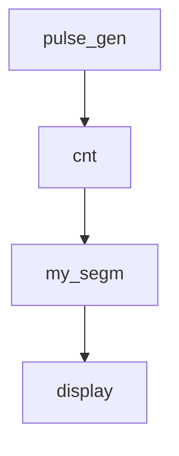

# Digital Counter on Verilog / Цифровой счётчик на Verilog

📌 This project implements a digital counter system on Verilog, synthesized and tested on an FPGA board. It includes pulse generation, a multi-digit counter, 7-segment display output, and reset functionality.

📌 Проект реализует цифровой счётчик на языке Verilog с синтезом и тестированием на ПЛИС. Включает генератор импульсов, многозначный счётчик, вывод на семисегментный индикатор и функцию сброса.

## 💡 Features / Возможности

- 1-second pulse generation / Генерация импульсов с частотой 1 Гц
- 4-digit decimal counter / 4-разрядный десятичный счётчик
- Modular architecture (pulse_gen, cnt, segm, wrapper) / Модульная архитектура
- 7-segment display control / Управление семисегментным индикатором
- Reset function / Функция сброса
- Synthesis and loading via Quartus II + JTAG / Синтез и прошивка через Quartus II + JTAG

## 📂 Project Structure / Структура проекта

| File | Description (EN) | Описание (RU) |
|------|------------------|----------------|
| `prj_wrap.v` | Top-level wrapper module | Обёртка: объединяет все модули |
| `pulse_gen.v` | Pulse generation module | Генератор импульсов |
| `cnt.v` | Counter logic | Модуль счётчика |
| `my_segm.v` | 7-segment decoder | Декодер 7-сегментного дисплея |

## 📸 Visualization / Визуализация

```verilog
// Wrapper connections
prj_wrap(
  clk, rst_n, keys -> leds, seg, dig
)
```



## 🛠 Tools Used / Используемые средства

- Quartus II
- Verilog HDL
- FPGA board with 7-segment display and LEDs

## 🚀 How to Use / Как запустить

1. Склонируйте проект и откройте в Quartus II
2. Выполните синтез всех модулей
3. Подключите ПЛИС по JTAG
4. Загрузите прошивку
5. Управляйте счётом с помощью кнопок / наблюдайте результат на индикаторе


https://github.com/user-attachments/assets/17200150-dbcc-4123-9c7d-0d3d6378299e


